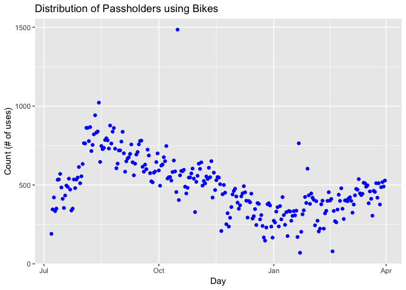
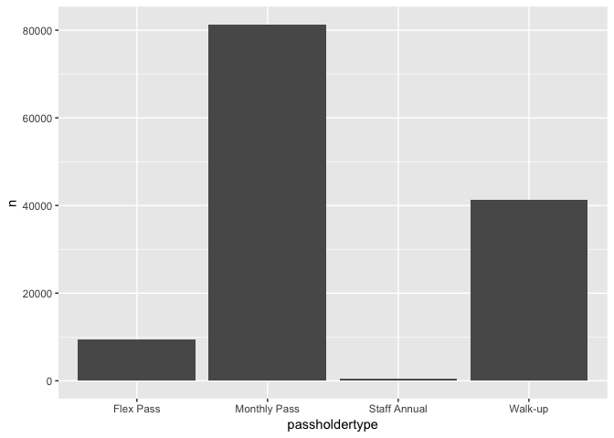
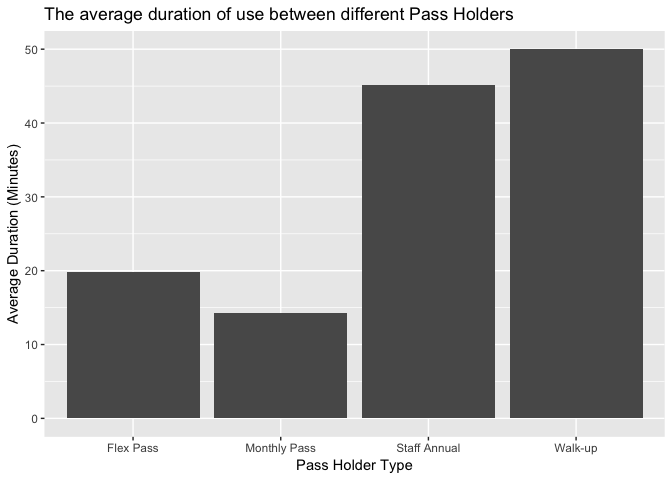

Capital One Project
================
Jerry Liu
October 2018

### Load libraries

For this project, we'll be using the TidyVerse package to help with data analysis.

### Loading data

First, we load the data in the bike data from the csv file and also rename some columns for easier use in later analysis.

### Investigating how Bike Usage Changes over the Seasons

Here we graph the number of bike uses each day. We can see that bike use is cyclical, with usage peaking in the summer and at its low points during the winter.



### Types of Bike Users

Here, we can see that most people using the bikes are monthly pass users, but there are still a decent amount of people using walk up.

``` r
y = count(bikes, passholdertype)
y
```

    ## # A tibble: 4 x 2
    ##   passholdertype     n
    ##   <chr>          <int>
    ## 1 Flex Pass       9517
    ## 2 Monthly Pass   81304
    ## 3 Staff Annual     382
    ## 4 Walk-up        41224

``` r
ggplot(y, aes(passholdertype, n)) + geom_col() 
```



### Investigating how usage of bikes changes

This graph shows something very interesting, in that people using the bikes as walk-ups use them on average 2-3x longer than monthly or flex pass holders.

``` r
x = bikes %>%
  group_by(passholdertype) %>%
  summarise_at(vars(duration), funs(mean(., na.rm=TRUE)))
x$duration = x$duration/60

ggplot(x, aes(passholdertype, duration)) + geom_col() + labs(title="The average duration of use between different Pass Holders") + labs(x = "Pass Holder Type") + labs(y = "Average Duration (Minutes)")
```



### What are the most popular start/stop stations?

Let's take a look at the most popular start/stop stations. In order to do this, I first grouped by start and end station id's and then counted the number of occurences of those id's.

``` r
MostFreqentStart = count(bikes, ssid) %>%
  arrange(desc(n)) %>%
  head(5) 
names(MostFreqentStart) <- c("Starting Station ID", "Frequency")
MostFreqentEnd = count(bikes, esid) %>%
  arrange(desc(n)) %>%
  head(5) 
names(MostFreqentEnd) <- c("Ending Station ID", "Frequency")
MostFreqentEnd
```

    ## # A tibble: 5 x 2
    ##   `Ending Station ID` Frequency
    ##                 <int>     <int>
    ## 1                3005      6262
    ## 2                3031      5517
    ## 3                3014      5385
    ## 4                3042      5293
    ## 5                3069      5072

``` r
names(MostFreqentStart) <- c("Starting Station ID", "Frequency")
MostFreqentStart
```

    ## # A tibble: 5 x 2
    ##   `Starting Station ID` Frequency
    ##                   <int>     <int>
    ## 1                  3069      5138
    ## 2                  3030      5059
    ## 3                  3005      4883
    ## 4                  3064      4661
    ## 5                  3031      4629

### What is the average distance traveled?

``` r
bikes = bikes %>%
  filter(duration>1)
mean(bikes$duration)
```

    ## [1] 1555.302

``` r
1555.302
```

    ## [1] 1555.302

Here, we can see that the mean amount of time people spent on their bikes was 1555 seconds, which is about 26 minutes. If we assume these people were biking at a average pace of around 10mph, we can conclude that the average trip length was around 26/60\*10 miles, or `4.3` miles.

### How many riders include bike sharing as a regular part of their commute?

``` r
RegCommute = count(bikes, passholdertype) %>%
  arrange(desc(n)) %>%
  head(5)
names(RegCommute) <- c("Pass Type", "# of people using")
RegCommute
```

    ## # A tibble: 4 x 2
    ##   `Pass Type`  `# of people using`
    ##   <chr>                      <int>
    ## 1 Monthly Pass               81304
    ## 2 Walk-up                    41224
    ## 3 Flex Pass                   9517
    ## 4 Staff Annual                 382

Let's assume that people who use the walk-up pass aren't regular users and therefore don't use it as part of their commute. Summing up the people who bought passes, 81304+41224+382 = `122,910`. Thus, we conclude that `(122,910)/(122,910+41224)` is the % of people using the bikes for their regular commute. This evalulates to around 74.8% of users.
